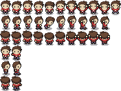
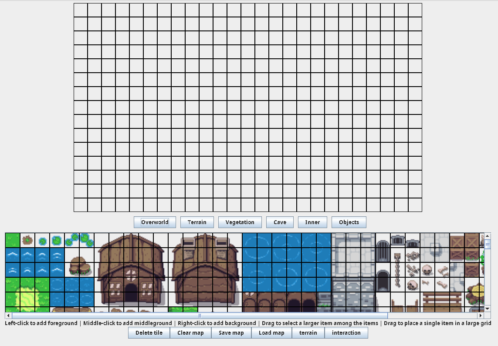

<!--toc:start-->
- [Basic Usage](#markdown-header-basic-usage)
- [What is this?](#markdown-header-what-is-this)
  - [The Player Character](#markdown-header-the-player-character)
    - [Controls](#markdown-header-controls)
    - [Items](#markdown-header-items)
    - [Looting](#markdown-header-looting)
  - [The map](#markdown-header-the-map)
    - [World](#markdown-header-world)
  - [Enemies](#markdown-header-enemies)
  - [Other Functionality](#markdown-header-other-functionality)
    - [Map Creation](#markdown-header-map-creation)
      - [Delete Tile](#markdown-header-delete-tile)
      - [Clear map](#markdown-header-clear-map)
      - [Save map](#markdown-header-save-map)
      - [Load map](#markdown-header-load-map)
      - [terrain](#markdown-header-terrain)
      - [interaction](#markdown-header-interaction)
      - [enemies](#markdown-header-enemies)
      - [collider and terrain border color scheme](#markdown-header-collider-and-terrain-border-color-scheme)
- [Asset packs](#markdown-header-asset-packs)
<!--toc:end-->

# Basic Usage
Play by either doing:
```console
$ mvn package assembly:single
$ java -jar target/rouge_dungeon-1.0-SNAPSHOT.jar
```

Or by doing:
```console
$ mvn clean compile exec:java
```

Otherwise, one can of course run it through their IDE.

# What is this?

This project will be an educational one with the goal and intent to create a [The Legend of Zelda] [1]
-like [dungeon-crawler] [2] [action-adventure] [3] RPG.

The intention is to create a 2D-graphics game, with pixel-graphics without using a game-engine, that in
the end will be similar to The Legend of Zelda.

## The Player Character



The character has the ability to move in all directions, be able to attack using weapons and attack
enemies with them.

### Controls

* Movement:
  ```
      w
      ∧
      |
  a <- -> d
      |
      v
      s
  ```
* Use: e
* Attack: <space>

### Items

Items are automatically picked up when walked over.

If an item is usable, such as a sword, then by pressing the attack-button uses that item to attack.

### Looting

Certain containers can be interacted with, and can either give the player coin, or a new sword.
The sword is automatically equipped, and replaces the old sword.

## The map


### World

The world is composed of different maps, that the player can visit in any order.
Certain maps have enemies that the player can then fight with.

## Enemies

By attacking an enemy with your sword, and reducing their health to zero, you have a chance to get
either health or coin.

## Other Functionality

### Map Creation



By using the tool provided, one can create their own maps that contain information such as where to
go next, what objects one can interact with and similar

The program can either be reached by:

```console
$ mvn package assembly:single
$ java -jar target/rouge_dungeon-1.0-SNAPSHOT.jar
```

And pressing the "Create World"-button available in the initial menu

Or by doing:
```console
$ mvn clean compile exec:java@create_world
```

The creation tool contains 6 buttons that can be used to switch between different
map assets for creating the world. By clicking on one tile or selecting multiple tiles
from the assets these can then be placed on the player grid. When placing multiple 
tiles the top left corner will be the starting point for the placement of them. 

There are 3 layers to the player grid a background layer that is added by right-clicking 
when adding the tiles, middle layer added by pressing the scroll wheel and the 
foreground layer added by left-clicking when adding the tiles to the grid.

Below the assets are also some instructions and then some buttons: 

#### Delete Tile

By pressing the Delete tile button it will be selected and when pressed on the player grid
it will delete the selected tile icon on the specific layer, if multiple assets are
selected it will delete the tile icons in the selected grid pattern. 

#### Clear map

The clear map button clears everything from the player grid.

#### Save map

Saves the player grid with everything added to it to a file with selected name
added in a popup window that asks for a name to be entered.

#### Load map

Opens a fileSelector were a player map then can be chosen. This is then loaded
onto the player grid and if anything was added to the player grid before loading
a map it will be deleted.

#### terrain

The terrain button disables the functionality for adding assets to the grid and
the user is prompted with 2 buttons on the right of the player grid. 

The addTerrain is used to drag a square on the player grid the designate this area 
as terrain so that when the player then plays game can´t walk through this area. 

The remove button removes the terrain area that are pressed on.

#### interaction

The interaction button disables the functionality for adding assets to the grid and
the user is prompted with 8 buttons on the right of the player grid.

addInteraction allow for a square to be drawn this in it shelf is not used for
anything.

setLoot is used by pressing on an existing interaction area to make it a loot
area, this together with the legendary, rare and common button selects the value
the loot in the container should have (default to common loot).

setSpawn creates a small square just by pressing on a location where the map creator
want the player to spawn in when they enter the area.

addTransportMap is created by drawing a square on the area the map creator want
the user to be moved to the next map when it enters. After releasing the button 
for placing that area the map creator is then prompted with a file selector to
select which map they want the user to be transported to. This will then display
the selected map in a new window and by clicking on a spawn point (turquoise) square
the transport location will be set to there.

removeInteraction removes any area that is clicked on.

#### enemies

The interaction button disables the functionality for adding assets to the grid and
the user is prompted with 2 buttons on the right of the player grid.

addEnemy allows for a square area to be drawn where a log will then be spawned 
on the top or left of the grid. Depending on how the grid is drawn, the log will
then move UP and DOWN or LEFT to RIGHT in the middle of the drawn area.

removeEnemy removes the enemy that is clicked on.

#### collider and terrain border color scheme

back ground (BLACK)\
middle ground (LIGHT-GRAY)\
fore ground (YELLOW)\

terrain collider (RED)\
spawn collider (TURQUOISE)\
enemy collider (PURPLE)\

loot collider:\
common (BLUE)\
rare (MAGENTA)\
legendary (ORANGE)

# Asset packs
These are the assets borrowed from the different creators.

cave, character, font, inner, log, NPC_test, objects, overworld
https://opengameart.org/sites/default/files/gfx_3.zip

weapons
https://w3g3a5v6.ssl.hwcdn.net/upload2/game/1761994/6719231?GoogleAccessId=uploader@moonscript2.iam.gserviceaccount.com&Expires=1677081016&Signature=B2NBpaUu0myY8%2Fbv7PaPJP0ijS5j2ab%2B2ep7N3i60CxPG4YHiCvA9dn77R%2BtkK5XC%2BmFNVR08Fyi5F97HVFScyjJYhc9O90i4M%2F%2FTcFGgVKCRndAb3eJNDYJxgxfn7jKZj%2B3qUxxPy3U3XxK%2F8Dmh%2BswD0vyYviXHZsPngETiNY8ovpcxX2ChmZeorsqsrn4NSND1MRWUIxUmoeLYZTBdn1DAa5YiizV2rXn%2BBaDMfTrY3LM%2BpA%2F2oyq29Lmw8l26jz5pGhpSfoR7bAt1QG3WIbh%2Fu5OvqQ2YFnfD44%2BFI0Wm4qBZHnip%2BvscoLuyaj%2F%2FNwOVX7%2BZy22ERA07vt1ow==&hwexp=1677081276&hwsig=c531ffdc518cbff41af94a7ecd5eca5c

terrain, vegetation
https://w3g3a5v6.ssl.hwcdn.net/upload2/game/1534012/6962272?GoogleAccessId=uploader@moonscript2.iam.gserviceaccount.com&Expires=1675283196&Signature=I5yuUN2WniW1SxlDZfAEX%2BYUI3Sq6nvTNUFXC8Dq0NYWUyOi%2Bfisjq35dROjY1jhoUyv6cyy%2FHsaTgM0krnURopl%2FN9YvT0u78bKYkDHLmTQPYDp8ONtxz8etzFmtYlsbXjXCfvTjXrUxjPDl1SIXMUUlSsL9X05KsY%2FK7YsNPPqr8cS2c8ZqMlP6VtPaGdmVPvpqoj1Di0DjPVdI4kpvI8IgBTPSF0%2FI8PQsaNcKlKXzds5YrzLHL8akVfbGJFpinfqccX0aaaBTkqJPmh%2F4D9bZHoeA6FUYVI%2BMh4BkUjWyTLYAW2FV3lDEpKz6ziwe6%2F7loJI5P8%2B9KJC9uaseQ==&hwexp=1675283456&hwsig=ec6fc55a9ec4aba6146c5af7e275aae8

[1]: https://en.wikipedia.org/wiki/The_Legend_of_Zelda_(video_game) "The Legend of Zelda"
[2]: https://en.wikipedia.org/wiki/Dungeon_crawl "dungeon-crawler"
[3]: https://en.wikipedia.org/wiki/Action-adventure_game "action-adventure"
[4]: ./src/main/resources/Terrain.png "Terrain"
[5]: ./src/main/resources/character.png "character"
[6]: ./src/main/resources/Overworld.png "Overworld"
[7]: https://stackoverflow.com/questions/65907092/where-should-i-put-the-game-loop-in-the-swing-app "Game Loop"
